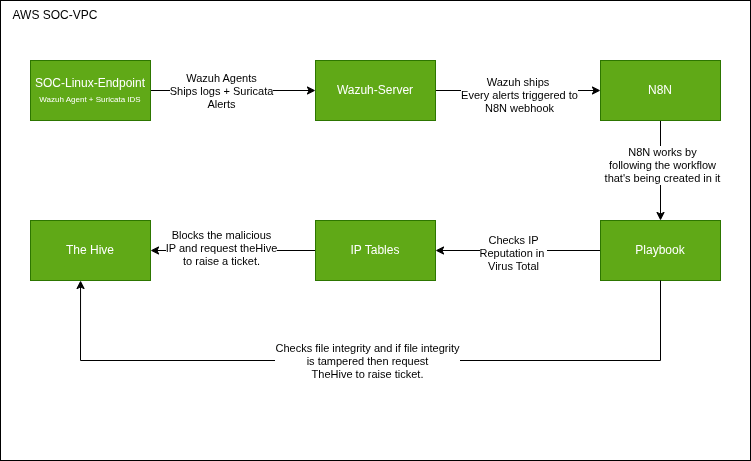

# Project Report - SOC Mini System Architecture.

**Submited by**: Nizamudheen KN  
**Date Created**: 03-05-2026  
**Category**: S0C (Security Operations Center)  
**Platform**: AWS (Amazon Web Services)  

---

## 1. Project Summary.

This is a real world mini SOC workflow. The main goal is to detect external threats like port scanning, ssh brute force, ping from external IP and checking the external IP's reputation. If IP is malicious then we will be blocking that IP address using IP tables in the endpoint else we will create a ticket in theHive. SO the work flow be like Endpoint which is installed with wazuh (SIEM) agent and suricata IDS sends logs to the wazuh server ➡️ Wazuh server cross checks every events with the rules and if rules matches then triggers alert ➡️ N8N webhook captures the alerts thats being triggered in the wazuh and starts executing the playbook ➡️ If IP is malicious then blocks the IP using IP tables firewall in the endpoint ➡️ Raises ticket in theHive platform.
